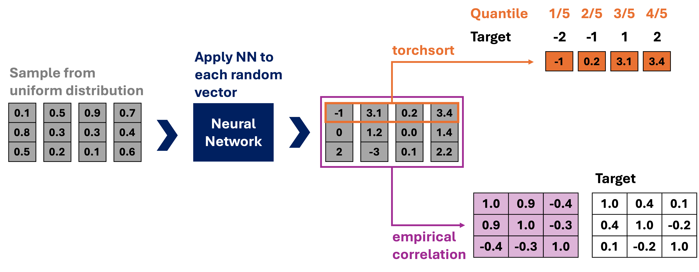

# Joint Distribution Generator

This repository was inspired by the [Synthetic Data Generation with GenAI](https://www.mdsi.tum.de/en/di-lab/vergangene-projekte/ss24-pwc-synthetic-data-generation-with-genai/) project by PwC for the [TUM Data Innovation Lab](https://www.mdsi.tum.de/en/di-lab/tum-di-lab/). Two of my friends who participated in this project shared their challenge with me: to simulate data x ∈ ℝᵈ from a multivariate distribution based on two requirements:

1. The marginal distributions of the variables must match specific distributions (e.g., x₁ ~ N(4, 3²), x₂ ~ Exponential(λ = 4), ...).
2. The correlation between these variables must align with a given correlation matrix A (Cor(x) = A).

It’s one of those problems that seems so straightforward to understand that you instinctively assume it would be easy to solve. Therefore, I was surprised to learn that no good solution for this problem existed and that they were struggling to come up with one. Still, driven by the naive belief that a good solution must exist, I spent an afternoon — which quickly turned into a late night — hacking together a new approach. Looking back, I think I got incredibly lucky, as my approach ended up working surprisingly well. So, I decided to share it online. Just in case anyone stumbles across the same problem as my friends any time soon. 

## Why we can not use conventional Generative Models

At its core, my approach is quite similar to many state of the art generative models, such as normalizing flows or diffusion models, which also aim to learn some target distribution. These models typically start by sampling from a simple distribution (e.g., the uniform distribution) and then apply a learnable function (think neural network) to transform these samples into samples of the target distribution. Of course this wont happen by accident.

To achieve this, the models use a measure that quantifies how close the transformed samples are to the target distribution. This measure allows them to adjust the network’s weights to produce samples that better align with the desired target distribution. Iterate this a couple of times et voila we have something like Stable Diffusion (disclaimer: very strong simplification).

So if there already exists such algorithms why aren't we using them. The reason is that the target distribution is almost never explicitly defined — for example, we do not usually know that “variable 1 should follow a normal distribution with a certain mean.” Instead, the target distribution is implicitly defined by a (preferably large) dataset. As a result, the measures used by these models compare the output of the neural network with individual data examples. Therefore, we need a differentiable way to measure how close the samples produced by our neural network are to the target distribution explicitly defined by the marginals and their correlation.

## Coming up with a differentiable Loss

The main idea behind the loss is to always generate samples in sets consisting of let us say 1000 individual samples. We then use a learnable function — a simple neural network — to transform each sample within such a set, one by one. This way, we end up with a complete set of samples that should ideally follow the target distribution. To determine if this is the case, we evaluate two key properties:

1. **Marginal Loss**: The marginal distributions of the transformed sample set should match the predefined marginal distributions. Consider the first variable, x₁, which should follow N(4, 3²). One way to verify this is by comparing the quantiles. For example, the empirical 22% quantile for x₁ of the transformed sample set should be close to the 22% quantile of the respective target marginal distribution N(4, 3²). To quantify this, we can compute the squared difference between the empirical quantiles of our transformed sample set and the corresponding quantiles of the target distribution. However, to train the neural network, we need to compute these differences in a differentiable manner. The computation of empirical quantiles boils down to sorting the value. While the standard `torch.sort` function in PyTorch is not differentiable, the `torchsort` library provides a differentiable sorting function that allows us to achieve this.
2. **Correlation Loss**: We also need a way to ensure that the correlations between variables are as intended. This can be achieved by computing the empirical correlation matrix from the sample set and comparing it to the desired correlation matrix. The difference between these matrices serves as our measure of correlation loss.




## Installation

Follow these steps to set up the project environment and install the required libraries:

1. **Create a virtual environment**:
    ```bash
    python -m venv venv
    ```

2. **Activate the virtual environment**:
    - On Windows:
      ```bash
      venv\Scripts\activate
      ```
    - On macOS/Linux:
      ```bash
      source venv/bin/activate
      ```

3. **Install the required libraries**:
    ```bash
    pip install -r requirements.txt
    ```

## Usage

To train the model, follow these steps:

1. **Configure the marginals and the correlation matrix**: Edit the `train.py` script to set up the desired marginal distributions and the correlation matrix for the joint distribution.

2. **Run the training script**:
    ```bash
    python train.py
    ```

### Output

After the model is successfully trained, you can find the following outputs in the `/plots` folder:

- Plots showing the generated marginals plotted against the true marginal distributions.
- A comparison of the predefined and empirical correlation matrices.


## Results

The results of running train.py are shown below. The code ran for approximately 15 minutes on my MacBook Air. The plots indicate that this approach yields good approximations for the marginals while also maintaining the correlation. I believe there is still room for improvement through hyperparameter tuning, particularly for the neural network.

### Correlation Matrix


### Marginal Distributions


## TODO

- Many datasets also include categorical data, which is not currently supported. One potential solution is to use the Gumbel trick to generate differentiable samples of such distributions.
- It would be neat to anonymize a given dataset. This would involve first fitting distributions to the dataset, then using these distributions and the correlation to generate an anonymized version of the dataset.
---
