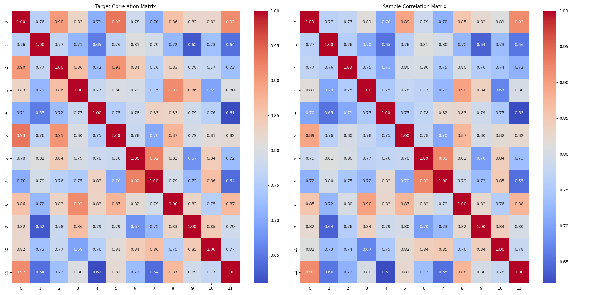
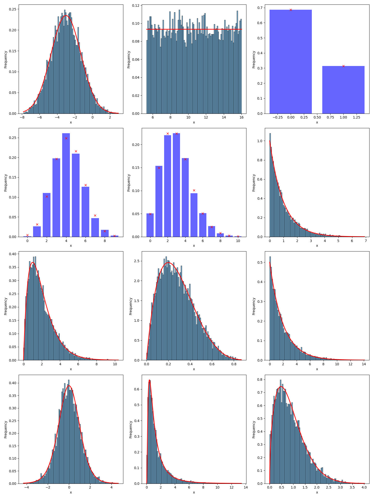

# Joint Distribution Generator

This repository was inspired by the “Synthetic Data Generation with GenAI” project by PwC for the TUM Data Innovation Lab. Two of my friends who participated in this project shared their challenge with me: to simulate data from a multivariate distribution based on two key requirements:

1. The marginal distributions of the variables must match specific forms (e.g., variable 1 should follow a normal distribution with a mean of 2 and a standard deviation of 4, while variable 2 should follow an exponential distribution with a rate parameter, lambda = 4).
2. The correlation between these variables must align with a given correlation matrix.

It’s one of those problems that seems so straightforward to understand that you instinctively assume it would be easy to solve. Therefore, I was surprised to learn that no good solution for this problem existed and that they were struggling to come up with one. Still, driven by the naive belief that a good solution must exist, I spent an afternoon — which quickly turned into a late night — hacking together a new approach. Looking back, I think I got incredibly lucky, as my approach ended up working surprisingly well. So, I decided to share it online. Just in case anyone stumbles across the same problem as my friends any time soon. 

## Overview

In this project, we have implemented a generator capable of producing samples from a custom joint distribution defined by marginal distributions (using `scipy.stats`) and a correlation matrix. The core idea is to use a neural network to transform random uniform noise into the desired joint distribution. This neural network processes multiple uniform noise samples together and transforms them into a sample set of the approximated target distribution.

The loss function, computed based on a set of generated samples, consists of two components:
- Correlation Loss: The generated samples are used to compute their empirical correlation matrix. The loss is then calculated by taking the absolute difference between this empirical correlation matrix and the desired correlation matrix.

- Marginal Loss: For each marginal distribution, differentiable sorting (using the `torchsort` library) is employed to compute differentiable quantiles of the samples. The loss is then determined by computing the absolute difference between these empirical quantiles and the actual quantiles of the desired marginal distribution scaled.


## Installation

Follow these steps to set up the project environment and install the required libraries:

1. **Create a virtual environment**:
    ```bash
    python -m venv venv
    ```

2. **Activate the virtual environment**:
    - On Windows:
      ```bash
      venv\Scripts\activate
      ```
    - On macOS/Linux:
      ```bash
      source venv/bin/activate
      ```

3. **Install the required libraries**:
    ```bash
    pip install -r requirements.txt
    ```

## Usage

To train the model, follow these steps:

1. **Configure the marginals and the correlation matrix**: Edit the `train.py` script to set up the desired marginal distributions and the correlation matrix for the joint distribution.

2. **Run the training script**:
    ```bash
    python train.py
    ```

### Output

After the model is successfully trained, you can find the following outputs in the `/plots` folder:

- Plots showing the generated marginals plotted against the true marginal distributions.
- A comparison of the predefined and empirical correlation matrices.


## Results

The results of running train.py are shown below. The code ran for approximately 15 minutes on my MacBook Air. The plots indicate that this approach yields good approximations for the marginals while also maintaining the correlation. I believe there is still room for improvement through hyperparameter tuning, particularly for the neural network.

### Correlation Matrix



### Marginal Distributions



## TODO

- Many datasets also include categorical data, which is not currently supported. One potential solution is to use the Gumbel trick to generate differentiable samples of such distributions.
- It would be neat to anonymize a given dataset. This would involve first fitting distributions to the dataset, then using these distributions and the correlation to generate an anonymized version of the dataset.
---
